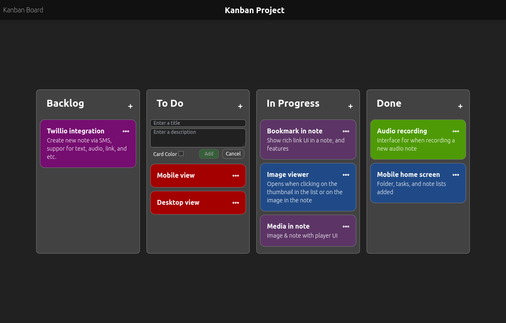

# Kanban Board

Fullstack kanban board web application.

[**Live Demo**](https://kanboardban.netlify.app)



## Setup

### Clone repo

```bash
git clone https://github.com/han109k/kanbanboard.git
```

Server & Client config.

```bash
npm install
npm start
```
